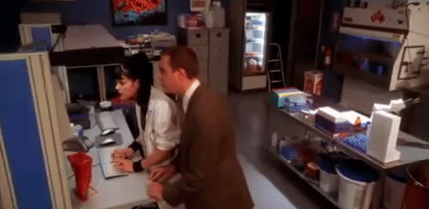

<!--
**PaulinoMoskwa/PaulinoMoskwa** is a ✨ _special_ ✨ repository because its `README.md` (this file) appears on your GitHub profile.

Here are some ideas to get you started:

- 🔭 I’m currently working on ...
- 🌱 I’m currently learning ...
- 👯 I’m looking to collaborate on ...
- 🤔 I’m looking for help with ...
- 💬 Ask me about ...
- 📫 How to reach me: ...
- 😄 Pronouns: ...
- ⚡ Fun fact: ...
-->

Machine learning engineer working in computer vision related fields. 
I enjoy learning and mastering new skills, now more than ever with my friendo ChatGPT 🤖

💻 Programming things in Python and C++ 
🧠 Artificial Intelligence 
👀 Computer Vision 
✨ Augmented Reality 
🧙‍♂️ Unity and Blender, mostly for CV applications, but also for digital art 

Find out more @ 
🪪 Portfolio: https://paulinomoskwa.github.io/Hello/ 
💼 LinkedIn: https://www.linkedin.com/in/paulina-moskwa/ 
🐦 Twitter: https://twitter.com/PaulinoMoskwa 
📬 Mail: pau.moskwa@gmail.com 

-----

    

